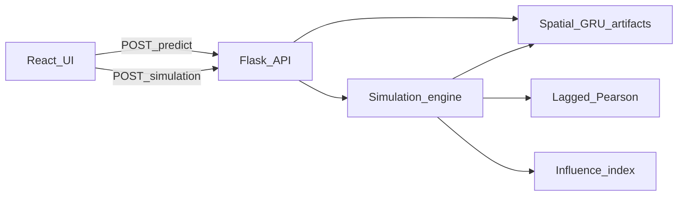

# Technical documentation

**Traffic Prediction Application: A Data-Driven Approach Using Deep Learning**

This document describes the implementation in this repository. Training is offline. The running application performs inference and historical simulation. It does not retrain models and it does not receive an external live traffic feed.

No research-paper file is stored in the repository. Model module comments refer to a paper architecture. This document does not add citations that are not in the repo. The raw file is the [Kaggle traffic prediction dataset](https://www.kaggle.com/datasets/fedesoriano/traffic-prediction-dataset) placed at `data/raw/traffic.csv`.

## 1. Problem and objectives

The application estimates hourly vehicle counts at four junctions and shows how those series are statistically associated at a chosen historical hour.

Implemented objectives:

- Clean the hourly series and build leakage-safe lag features.
- Train and compare LSTM, GRU, and CNN-LSTM on the baseline feature set.
- Train a Spatial GRU on 53 features over the period when all four junctions exist.
- Serve one-step Spatial GRU predictions through Flask to a React prediction view.
- At a requested historical timestamp, recompute directed lagged Pearson relationships and a formula-based influence index, then display that response.

These metrics describe the recorded experiments. They are not a guarantee of performance on later years or on other roads.

## 2. Dataset

Source: `results/dataset_inspection.txt`.

| Item | Value |
| --- | --- |
| Rows | 48,120 |
| Columns | `DateTime`, `Junction`, `Vehicles`, `ID` |
| Junctions | 1, 2, 3, 4 |
| Frequency | Hourly. Median gap is 1 hour on every junction |
| Missing cells | 0 |
| Full-row duplicates | 0 |
| Target | `Vehicles` |
| Overall range | 2015-11-01 00:00 through 2017-06-30 23:00 |

Junctions 1–3 each have 14,592 rows from 2015-11-01 00:00 through 2017-06-30 23:00. Junction 4 has 4,344 rows from 2017-01-01 00:00 through 2017-06-30 23:00. `ID` is a row identifier and is not a model feature.

The CSV does not contain weather, holiday labels, road type, GPS, speed, or occupancy. Those fields are not invented.

## 3. Preprocessing

### Baseline pipeline

Source: `results/preprocessing_report.txt`.

- Invalid timestamps dropped: 0. Duplicate junction-hours dropped: 0.
- Hourly slots inserted: 0. Short gaps filled: 0. The raw series had no missing hourly slots, so this run did not interpolate.
- The first 168 hours of each junction are dropped because lag 168 is undefined. Final rows: 47,448 (train 33,211, validation 7,115, test 7,122).
- Features (13): `hour`, `day_of_week`, `day`, `month`, `is_weekend`, `hour_sin`, `hour_cos`, `Junction`, and `vehicles_lag_1`, `vehicles_lag_2`, `vehicles_lag_3`, `vehicles_lag_24`, `vehicles_lag_168`.
- Split: chronological 70/15/15 **within each junction**, no shuffle. Junctions 1–3 test from 2017-04-01 19:00. Junction 4 test from 2017-06-04 21:00, because that series starts later.
- `MinMaxScaler` is fit on train only. Processed CSVs stay unscaled; scalers are stored under `models/artifacts/`.
- Lags may use earlier hours that fall in train when the row itself is in validation or test. That is past information. The target `Vehicles` at time T is not a feature.

IQR and Z-score outliers were counted and retained. Peak hours were not deleted.

### Spatial pipeline

Source: `results/spatial_preprocessing_report.txt`. This pipeline does not overwrite the baseline files.

- Keep only hours when all four junctions are observed (overlap begins 2017-01-01).
- Drop rows until lag 168 exists. The first usable hour is 2017-01-08 00:00.
- Final rows: 16,704 (train 11,692, validation 2,504, test 2,508).
- 53 features: the 13 baseline features, plus lagged network total and average, lagged per-junction traffic, and lagged other-junction traffic and average. Lags are 1, 2, 3, 24, and 168 hours.
- Counts at time T are not inputs. Missing Junction 4 hours are not filled with zero, a mean, or interpolation.
- Split is again 70/15/15 on the eligible per-junction series, so the calendar dates differ from the 2015–2017 baseline split.

## 4. Model architectures

Constants are in `ml/training/config.py`. Lookback is 168 hours for every trained model. The output is one linear unit: the next vehicle count in original units after the target scaler is inverted.

### Baseline LSTM

`ml/models/lstm.py`

Input `(168, 13)` → LSTM 128 with sequence output → Dropout 0.2 → LSTM 64 → Dense 32 ReLU → Dense 1 linear.

### Baseline GRU

`ml/models/gru.py`

Input `(168, 13)` → GRU 128 with sequence output → Dropout 0.2 → GRU 64 → Dense 32 ReLU → Dense 1 linear.

### Baseline CNN-LSTM

`ml/models/cnn_lstm.py`

Input `(168, 13)` → Conv1D, 32 filters, kernel size 3 → MaxPooling1D → LSTM 128 → Dense 32 ReLU → Dense 1 linear.

### Spatial GRU

Same GRU stack as the baseline GRU, with input `(168, 53)`.

- Weights: `models/trained/gru/spatial/model.keras`
- Feature scaler: `models/artifacts/spatial/feature_scaler.joblib`
- Target scaler: `models/artifacts/spatial/target_scaler.joblib`
- Feature list: `models/artifacts/spatial/feature_config.json`

`POST /api/predict` and the simulation engine both call this Spatial GRU. The baseline GRU service remains in the repository and is not the live prediction path.

## 5. Experimental results

Two different test sets are reported below. They must not be merged into one ranking.

### Baseline test set

Source: `results/model_comparison.csv`. This is the original per-junction 70/15/15 test split, 13 features.

| Model | RMSE | MAE | MAPE | R² |
| --- | ---: | ---: | ---: | ---: |
| LSTM | 5.353706 | 3.337543 | 13.944579% | 0.963205 |
| GRU | 5.101930 | 3.207288 | 13.479096% | 0.966585 |
| CNN-LSTM | 5.187203 | 3.274684 | 13.359807% | 0.965459 |

On this split, GRU has the lowest RMSE and MAE and the highest R². CNN-LSTM has the lowest MAPE. GRU was kept as the baseline architecture for that reason. MAPE can look better on a model that is worse on absolute error, especially where counts are small.

### Same period: baseline GRU and Spatial GRU

Source: `results/spatial_vs_baseline_gru_same_period.txt`.

Both models are scored on the same 2,508 rows from **2017-06-04 21:00:00** through **2017-06-30 23:00:00**. Neither model was retrained for this comparison. The baseline GRU here uses 13 features; the Spatial GRU uses 53. This is not the same test period as section 5.1.

| Experiment | RMSE | MAE | MAPE | R² |
| --- | ---: | ---: | ---: | ---: |
| Baseline GRU, same period | 5.8205 | 3.3154 | 16.2124% | 0.9623 |
| Spatial GRU | 5.2790 | 2.8757 | 15.0558% | 0.9690 |

Overall, Spatial GRU has lower RMSE, MAE, and MAPE and higher R² on this window. That is not true at every junction:

| Junction | Baseline RMSE | Spatial RMSE | Baseline MAE | Spatial MAE |
| --- | ---: | ---: | ---: | ---: |
| 1 | 7.3461 | 5.0446 | 5.2144 | 3.6088 |
| 2 | 3.5269 | 2.8681 | 2.8237 | 2.3052 |
| 3 | 7.7059 | 8.1916 | 3.1025 | 3.3515 |
| 4 | 3.1190 | 3.2705 | 2.1211 | 2.2372 |

Junctions 3 and 4 have higher Spatial GRU RMSE and MAE than the baseline GRU on this window. Junction 4 MAPE is lower for Spatial GRU (28.4552% versus 30.0276%) while R² is also lower (0.4540 versus 0.5034). The full per-junction block is in the source report.

## 6. Ablation

Source: `results/ablation/spatial_feature_ablation.txt`. Same 2,508-row window. Baseline and Full Spatial predictions were read from frozen artifacts. Network and Cross-junction GRUs were trained for the ablation only. No composite ranking score is assigned.

| Experiment | Features | What was added | RMSE | MAE | MAPE | R² |
| --- | ---: | --- | ---: | ---: | ---: | ---: |
| Baseline | 13 | Time features and own lags | 5.8205 | 3.3154 | 16.2124% | 0.9623 |
| Network | 23 | Lagged network total and average | 5.3679 | 2.9095 | 16.0339% | 0.9679 |
| Cross-junction | 43 | Lagged per-junction and other-junction traffic, without the network block | 5.8486 | 3.1001 | 15.6948% | 0.9619 |
| Full spatial | 53 | Baseline + network + cross-junction lags | 5.2790 | 2.8757 | 15.0558% | 0.9690 |

On the overall metrics, the network block and the full 53-feature model are lower in RMSE than the 13-feature baseline. The 43-feature cross-junction model is not lower in RMSE than that baseline (5.8486 versus 5.8205). Feature groups are lagged historical counts. They are not a claim that one junction causes traffic at another. Per-junction ablation numbers are in the same report; they do not all move in one direction.

## 7. Runtime architecture

Offline training writes models and scalers. Runtime inference loads them. Runtime simulation recomputes relationships and influence from the raw hourly file for the requested timestamp. The browser only draws the JSON.

Not implemented: Redis, PostgreSQL, Docker, cloud hosting, or a live traffic stream.

### API

Implemented in `backend/routes/traffic.py`. Details are in `backend/README.md`.

| Method | Path | Role |
| --- | --- | --- |
| GET | `/api/health` | Status and model name when Spatial GRU is loaded |
| GET | `/api/locations` | The four junctions |
| GET | `/api/history` | Recorded counts for a junction and window |
| POST | `/api/predict` | Spatial GRU one-step points for a 1–2 hour window |
| POST | `/api/simulation` | Relationships, influence, historical counts, and predictions at one hour |

`POST /api/predict` returns `model`, `features`, `lookback`, and `historical_simulation` with the forecast. The live model name is `Spatial_GRU`, with 53 features and lookback 168.

`POST /api/simulation` accepts `{"datetime": "2017-06-15T10:00:00"}`. The response separates:

- `junctions[].predicted_traffic` — Spatial GRU output
- `junctions[].historical_traffic` — observed vehicles at T, or null
- `junctions[].incoming_influence` — influence index, or null
- `relationships[]` — signed `correlation`, `absolute_correlation`, `lag_hours`
- `influence_result` — contributions and excluded contributions

HTTP 400 keeps the backend `error` string. Examples: `Invalid datetime.`, `Datetime must be aligned to a full hour.`, insufficient history, and the dataset-end message for any hour after 2017-06-30 23:00.

### Frontend

`src/App.tsx` switches between Prediction and Historical Traffic Network Simulation. Prediction keeps the map, query bar, and inspector. Simulation posts one timestamp from `src/api/simulation.ts` and renders `src/components/simulation/TrafficNetwork.tsx` plus the inspector in `SimulationPanel.tsx`. The client does not compute Pearson correlations or the influence sum. Edge thickness uses the returned absolute correlation only as a line weight.

## 8. Dynamic simulation

Implemented under `ml/simulation/`. For a timestamp T:

1. Reject a non-hour, an unparseable time, a time before the window can be filled, or a time after 2017-06-30 23:00.
2. Load raw `traffic.csv` rows inside the 168-hour window ending at T. Missing hours stay missing.
3. For each ordered pair of junctions and each lag k in `(1, 2, 3, 24, 168)`, compute

`C(source → target, k) = Pearson(V_source(t − k), V_target(t))`

Pairs match on the actual timestamp. A missing hour is skipped. A constant series is not given a correlation of zero. The selected lag is the one with the largest absolute correlation. If two lags tie, the earlier lag in that list is kept. The signed correlation is stored. There is no minimum-strength cutoff. The minimum paired count is 24.

4. For each selected relationship, if `V_source(T − lag)` exists in the window:

`contribution = absolute_correlation × V_source(T − lag)`

`influence_index = sum(included contributions)`

If that exact source hour is missing, the term is excluded with reason `missing exact source observation`. It is not replaced by zero. If a junction has no included contributions, `incoming_influence` is null.

5. Call the existing Spatial GRU `predict_request` once per junction. `Vehicles(T)` is not put in the feature tensor. The observed count at T is returned separately as historical traffic.

Signed correlation can be negative. The weight is still the absolute value, so the contribution is non-negative when the source count is positive. The sign remains visible in the relationship and contribution fields.

Stage 7 measured a real lag change on the dataset: junction 1 → 3 uses lag 24 at 2017-06-15 10:00 and lag 1 at 2017-06-25 10:00. Those June screens did not select a negative correlation and did not exclude a source. Stage 8 covers those cases with in-memory fixtures in `ml/simulation/tests/test_stage8.py`.

## 9. Testing evidence

The Stage 8 regression, recorded in `results/dynamic_simulation_stage8_report.txt`, ran each module once:

| Command | Result |
| --- | --- |
| `python -m unittest ml.simulation.tests.test_stage1` | 6 tests, OK |
| `python -m unittest ml.simulation.tests.test_stage2` | 8 tests, OK |
| `python -m unittest ml.simulation.tests.test_stage3` | 5 tests, OK |
| `python -m unittest ml.simulation.tests.test_stage4` | 5 tests, OK |
| `python -m unittest ml.simulation.tests.test_stage7` | 6 tests, OK |
| `python -m unittest ml.simulation.tests.test_stage8` | 5 tests, OK |
| `python -m unittest backend.test_simulation_api` | 9 tests, OK |
| `python -m unittest backend.test_simulation_stage7` | 4 tests, OK |

That is 48 tests in one regression pass. Earlier stage reports describe the same modules when they were first added. Those counts are not added again on top of 48.

`npm run lint` and `npm run build` passed in Stage 8. `package.json` has no `npm test` script. Browser checks covered both June simulation hours, invalid timestamps, prediction `POST /api/predict`, and duplicate-submit protection. A same-turn double `click()` is blocked by an in-flight ref in `SimulationPanel.tsx`.

Spatial `feature_config.json` lists 53 features, lookback 168, and does not list `Vehicles` as an input. The spatial prediction service raises if `Vehicles(T)` is placed in the tensor. Stage 8 SHA-256 hashes of the spatial and baseline models and scalers matched before and after the suite. See that report for the digest strings.

## 10. Limitations

- The series ends at 2017-06-30 23:00. A current date is rejected because it is outside the file, not because the server failed.
- No weather, holidays, GPS, speed, occupancy, or road graph is available.
- Correlations are associations. They do not prove a physical link or a cause.
- The SVG places four junctions for display. It is not a geographic map.
- Overall Spatial GRU metrics on the June 2017 overlap test are not uniform across junctions 3 and 4.
- MAPE is unstable when the actual count is small. Junction 4 MAPE is much higher than junction 1 MAPE in the same-period report.
- Negative selected correlations and excluded source hours were tested with synthetic series, not with the two demonstration timestamps.
- There is no browser unit-test script in `package.json`.

## 11. Future work

None of the following is implemented:

- A model update on data after June 2017, if a newer series is obtained.
- Weather or event features, only if a real source exists.
- A map that uses surveyed coordinates, only if those coordinates exist.
- A scheduled refresh. The current design is a historical replay, not a live feed.
- ARIMA, which is listed as not trained in `ml/README.md`.
